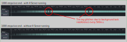

Usage
-----

   "A journey of a thousand miles begins with a single step"
   -- Laozi

Installation
............

pigpio
++++++
AdvPiStepper requires the `pigpio <http://abyz.me.uk/rpi/pigpio/>`__
library to work. If the `Remote GPIO <https://gpiozero.readthedocs.io/en/stable/remote_gpio.html>`__
has been enabled in the Raspberry Pi
configuration tool, then the pigpio daemon should already be installed
and running.
Run the following to check if pigpio daemon is installed and its version number:

.. code-block:: bash

   $ pigpiod -v
   76

If either pigpio is not installed or has a version smaller than 76 (the minimum
version required by AdvPiStepper), then refer to the pigpio
`download & install <http://abyz.me.uk/rpi/pigpio/download.html>`__ page on how to
install pigpio.

AdvPiStepper
++++++++++++

AdvPiStepper can be simply installed with

.. code-block:: bash

   $ pip install advpistepper

Usage
.....
AdvPiStepper is very simple to use. Here is a small example
using the :mod:`28BYJ-48 <advpistepper.driver_unipolar_28byj48>` driver:

.. highlight:: python
   :linenothreshold: 5

.. code-block:: python

   import advpistepper

   driver = advpistepper.Driver28BYJ48(pink=23, orange=25, yellow=24, blue=22)
   stepper = advpistepper.AdvPiStepper(driver)
   stepper.move(100, block = True)
   stepper.move(-100)
   while stepper.is_running:
      pass
   stepper.release()

This example will move the stepper motor 100 steps forward, waiting for it to finish, then move
it 100 steps backward without waiting.
Besides the obvious import of advpistepper, using it requires to instantiate a driver.

AdvPiStepper comes with multiple generic and specific drivers, refer to the `Drivers` Section
of the documentation for more details.
In this example the 28BYJ-48 Driver is used which needs four arguments, the gpio numbers that
the motor is connected to.

When using a motor with a step & direction interface the driver can instantiated like this,
with the step signal on pin 22 and the direction signal on pin 23

.. code:: python

   driver = advpistepper.DriverStepDirGeneric(step=22, direction=23)

The next line of the example initializes the stepper engine. It needs the driver as an argument
(without it defaults to a no-GPIO driver). It can take an optional argument with a Dict containing
parameters to overwrite the build in default parameters.

The last two lines of the example first move the stepper 100 steps forward, waiting for the move to finish,
then 100 steps backwards without waiting, that is with the move running in the background.

For all commands of AdvPiStepper refer to :mod:`the API <advpistepper.stepper>`

Tuning
......

To get the best performance from AdvPiStepper there should be as few
background processes running as possible. For expample, on the AdvPiStepper
development system (Raspi 4) the Desktop process does interfere with the
AdvPiStepper process about every 500ms causing step delays of a few milliseconds,
enough to cause late step pulses at high speeds (>500 steps per second)

If AdvPiStepper is called with root privileges (sudo) it will
decrease the niceness of the backend process to -10. This improves the
timing at high speeds somewhat due to less interference by normal
user processes.
